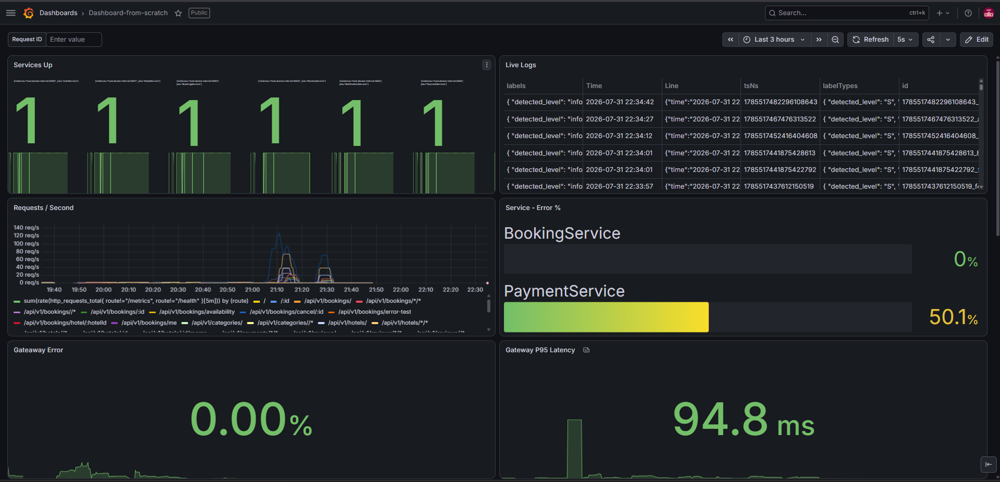
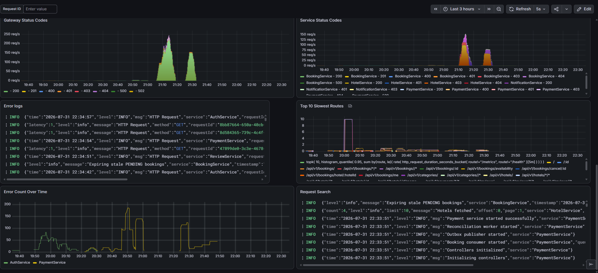

# Booking Platform

A full-stack microservices-based hotel booking platform with asynchronous event-driven communication, distributed locking, payment integration, and centralized observability.

---






## Table of Contents

1. [Project Overview](#project-overview)
2. [Architecture](#architecture)
3. [Async Event Capture](#async-event-capture)
4. [Message Queues & Exchanges](#message-queues--exchanges)
5. [Conditions Handled & Situations](#conditions-handled--situations)
6. [Features](#features)
7. [Services](#services)
8. [Infrastructure Stack](#infrastructure-stack)
9. [Setup](#setup)
10. [Tradeoffs](#tradeoffs)
11. [Observability](#observability)

## Project Overview

The Booking Platform is a distributed hotel reservation system composed of six independently deployable microservices across two languages (Go and Node.js). It implements the transactional outbox pattern for reliable event publication, Redlock-based distributed locking for concurrent booking protection, and a fanout exchange topology for pub/sub event distribution. The system is designed to handle real-world failure modes — lost events, duplicate messages, partial payment captures, and concurrent double-booking attempts — without data inconsistency.

---

## Architecture

### High-Level Topology

```
┌──────────────────────────────────────────────────────────────────────────┐
│                              Frontend (Next.js)                          │
│   Hotels · Bookings · Payments · Reviews · Admin · Hotel Manager       │
└─────────────────────────────────┬────────────────────────────────────────┘
                                    │ HTTP (JWT-authenticated)
                    ┌───────────────┴───────────────┐
                    │        AuthService (Go :3000)   │
                    │   API Gateway / BFF + RBAC      │
                    └──┬──────┬──────┬──────┬────────┘
                       │      │      │      │
          ┌────────────┘      │      │      └────────────┐
          │                   │      │                   │
  ┌───────▼────────┐  ┌──────▼──────▼──────┐  ┌─────────▼─────────┐
  │  HotelService   │  │  BookingService    │  │   ReviewService    │
  │  (Node :3001)   │  │  (Node :3002)      │  │   (Go :3003)       │
  └────────────────┘  └──────┬─────────────┘  └───────────────────┘
                              │
                 ┌────────────┴────────────┐
                 │                         │
          ┌──────▼──────────┐  ┌──────────▼──────────┐
          │ PaymentService   │  │ NotificationService  │
          │ (Go :3005)       │  │ (Node :3004)         │
          └─────────────────┘  └──────────────────────┘

          ┌──────────┐  ┌──────────┐  ┌──────────────────┐
          │  Redis   │  │  MySQL   │  │    RabbitMQ        │
          │ (lock +  │  │ (per-svc │  │ (fanout exchanges │
          │  cache)  │  │   DBs)   │  │  + durable queues) │
          └──────────┘  └──────────┘  └──────────────────┘

          ┌──────────────────────────────────────────────┐
          │          Observability Stack                  │
          │  Prometheus → Grafana (metrics + dashboards) │
          │  Loki ← Promtail (centralized log aggregation)│
          └──────────────────────────────────────────────┘
```

### Communication Patterns

| Pattern | Where Used | Why |
|---------|-----------|-----|
| Synchronous HTTP (JWT) | Frontend → AuthService → downstream services | CRUD operations requiring immediate response |
| Fanout pub/sub (RabbitMQ) | BookingService → PaymentService, NotificationService | One event, multiple independent consumers |
| Fanout pub/sub (RabbitMQ) | PaymentService → BookingService, NotificationService | Payment state changes propagate to booking and notifications |
| Database polling (Outbox) | All services → RabbitMQ | Reliable event publication without distributed transactions |
| Distributed lock (Redis Redlock) | BookingService write path | Prevent concurrent double-booking on same room+dates |
| Cross-DB reconciliation | BookingService ↔ PaymentService | Recover lost events across service boundaries |

---

## Async Event Capture

### Transactional Outbox Pattern

Events are never published directly to RabbitMQ. Instead, they are written to an `outbox` table inside the same database transaction as the business operation. A background publisher polls the outbox and delivers to RabbitMQ. This guarantees **at-least-once delivery** without requiring distributed transactions.

```
┌─────────────────────────────────────────────────────────────────┐
│                    OUTBOX PUBLISH LIFECYCLE                      │
│                                                                  │
│  1. Business operation writes to DB + outbox in ONE transaction │
│  2. Publisher polls outbox every 5s                             │
│  3. SELECT ... FOR UPDATE SKIP LOCKED → commit immediately      │
│  4. Publish to RabbitMQ (no DB locks held during network I/O)  │
│  5. UPDATE outbox SET published = TRUE (short transaction)     │
│  6. If publish fails → row stays unpublished → retry next poll │
└─────────────────────────────────────────────────────────────────┘
```

### Event Deduplication

Every outbox event carries a unique `eventId` (UUID v4). Every consumer maintains a `processed_events` table. Before processing, consumers check:

```
Consumer receives { eventId, eventType, payload }
  → SELECT 1 FROM processed_events WHERE event_id = ?
  → if exists → ack + skip (duplicate, already processed)
  → if new → process business logic, then INSERT IGNORE INTO processed_events
```

This handles the crash scenario where the publisher crashes after publishing to RabbitMQ but before marking the outbox row as `published = true`. On the next poll, the event is re-sent. The consumer sees the same `eventId` and skips it.

### Event Flow Map

```
BOOKING CREATED FLOW:
  User reserves room
    → BookingService: acquire Redlock, conflict check, create booking (PENDING), write BOOKING_CREATED to outbox
    → Outbox Publisher: polls every 5s, publishes to booking_events_exchange (fanout)
    → PaymentService BookingConsumer: creates Razorpay order, saves payment (CREATED), writes PAYMENT_CREATED to outbox
    → PaymentService Outbox Publisher: publishes to payment_events_exchange (fanout)
    → User completes Razorpay checkout
    → PaymentService: verifies webhook HMAC, updates payment to CAPTURED, writes PAYMENT_CAPTURED to outbox
    → PaymentService Outbox Publisher: publishes to payment_events_exchange
    → BookingService PaymentConsumer: updates booking to CONFIRMED, finalizes idempotency key, updates Redis cache
    → NotificationService PaymentConsumer: sends payment confirmation email

BOOKING CANCEL FLOW:
  User cancels booking
    → BookingService: updates booking to CANCELLED, releases Redis lock, writes BOOKING_CANCELLED to outbox
    → Outbox Publisher: publishes to booking_events_exchange
    → PaymentService BookingConsumer: checks if payment is CAPTURED, initiates refund via Razorpay
    → PaymentService: writes PAYMENT_REFUNDED to outbox → publishes to payment_events_exchange
    → BookingService PaymentConsumer: sees already CANCELLED → skips (terminal state)
    → NotificationService: sends "Booking Cancelled" + "Payment Refunded" emails

BOOKING EXPIRE FLOW:
  Expiry Cron (every 60s)
    → Finds PENDING bookings past expiresAt with no active CAPTURED payment
    → Updates status to EXPIRED, releases Redis lock, writes BOOKING_EXPIRED to outbox
    → NotificationService: sends "Booking Expired" email
```

### Event Loop Prevention

`handlePaymentRefunded` checks `booking.status === "CANCELLED"` before processing. If already cancelled, it returns early. This prevents infinite loops:

```
PAYMENT_REFUNDED → BOOKING_CANCELLED → refund check → already CANCELLED → stop
```

---


---

## Message Queues & Exchanges

### RabbitMQ Topology

#### Exchange: `booking_events_exchange` (fanout, durable)

| Property | Value |
|----------|-------|
| Type | fanout |
| Durability | durable |
| Publisher | BookingService outbox-publisher |
| Consumers | PaymentService (booking-service-payment-events queue), NotificationService (notification-service-booking-events queue) |
| Purpose | Broadcast booking lifecycle events to all interested services |

#### Exchange: `payment_events_exchange` (fanout, durable)

| Property | Value |
|----------|-------|
| Type | fanout |
| Durability | durable |
| Publisher | PaymentService outbox-publisher |
| Consumers | BookingService (booking-service-payment-events queue), NotificationService (notification-service-payment-events queue) |
| Purpose | Broadcast payment state changes to all interested services |

#### Queue: `booking-service-booking-events`

| Property | Value |
|----------|-------|
| Bound to | booking_events_exchange |
| Consumer | PaymentService BookingConsumer |
| Handles | BOOKING_CREATED → create Razorpay order |
| Durability | durable |
| Prefetch | 1 |

#### Queue: `booking-service-payment-events`

| Property | Value |
|----------|-------|
| Bound to | payment_events_exchange |
| Consumer | BookingService PaymentEventConsumer |
| Handles | PAYMENT_CAPTURED → confirm booking, PAYMENT_FAILED → cancel booking, PAYMENT_REFUNDED → cancel booking |
| Durability | durable |
| Prefetch | 1 |

#### Queue: `notification-service-booking-events`

| Property | Value |
|----------|-------|
| Bound to | booking_events_exchange |
| Consumer | NotificationService booking-notification worker |
| Handles | BOOKING_CONFIRMED → send confirmation email, BOOKING_CANCELLED → send cancellation email, BOOKING_EXPIRED → send expiry email |
| Durability | durable |
| Prefetch | 1 |

#### Queue: `notification-service-payment-events`

| Property | Value |
|----------|-------|
| Bound to | payment_events_exchange |
| Consumer | NotificationService payment-notification worker |
| Handles | PAYMENT_CAPTURED → send payment confirmation email, PAYMENT_FAILED → send payment failed email, PAYMENT_REFUNDED → send refund email |
| Durability | durable |
| Prefetch | 1 |

#### Queue: `notification-service-email-queue`

| Property | Value |
|----------|-------|
| Bound to | — (direct worker dispatch) |
| Consumer | NotificationService email worker |
| Handles | Generic template-based emails via Nodemailer + Handlebars |
| Purpose | Decouples email rendering from event consumption |

### Why Fanout, Not Competing Consumers

Each service declares its own queue bound to the exchange. When a message is published, RabbitMQ delivers a **copy** to every bound queue. This prevents one slow consumer (e.g., sending emails via SMTP) from blocking another (e.g., confirming a booking). If competing consumers were used instead, a slow email worker would delay payment confirmation.

---

## Conditions Handled & Situations

### Concurrent Booking Prevention

| Condition | Situation | Handling |
|-----------|----------|----------|
| Two users book same room for overlapping dates | High contention on popular room | Redlock distributed lock (8s TTL) acquired before DB transaction; DB row lock via `FOR UPDATE` |
| Redis hold key exists for room+dates | Fast-path rejection without DB lock | Availability cache checked first; if any date is occupied, reject immediately |
| Redis key expired but DB row still PENDING | Stale cache entry | DB conflict check catches this — the cache is advisory only, DB is source of truth |
| Prior PENDING booking not yet expired | User tries to book same room during pending window | Conflict check rejects — PENDING bookings still hold the room |
| Prior PENDING booking past expiresAt | Expired booking no longer holds room | Conflict check ignores expired PENDING bookings |

### Payment Failure Scenarios

| Condition | Situation | Handling |
|-----------|----------|----------|
| Razorpay webhook arrives with invalid HMAC | Tampered or forged webhook | Request rejected with 401; no state change |
| Payment already CAPTURED/FAILED | Duplicate webhook delivery | Idempotent processing — skip if already in terminal state |
| Payment DB write succeeds but Razorpay API call fails | Partial failure | Payment stays in CREATED state; reconciliation cron detects and retries |
| BOOKING_CAPTURED event lost between services | Outbox row published but consumer crashes before processing | Reconciliation cron (every 120s) cross-checks CAPTURED payments against PENDING bookings |
| User cancels booking with CAPTURED payment | Refund needed | PaymentService initiates Razorpay refund via claim/reclaim pattern with FOR UPDATE |

### Event Delivery Guarantees

| Condition | Situation | Handling |
|-----------|----------|----------|
| Publisher crashes after RabbitMQ publish but before marking outbox row | Event re-sent on next poll | Consumer `processed_events` table deduplicates by eventId |
| Consumer crashes mid-processing | Message requeued by RabbitMQ (noAck=false) | Idempotent consumer logic handles re-delivery |
| RabbitMQ broker restarts | All durable queues survive | Messages persist; consumers reconnect and re-deliver |
| Outbox publisher network blip | Publish fails, row stays unpublished | Next poll cycle retries; no event loss |

### Booking Lifecycle Conditions

| Condition | Situation | Handling |
|-----------|----------|----------|
| Booking PENDING for >15 minutes with no active payment | User abandoned checkout | Expiry cron marks EXPIRED, releases Redis lock |
| Booking PENDING with CREATED payment | User mid-checkout | Expiry cron excludes — prevents premature expiry |
| Booking CONFIRMED + stay completed | User checked in and out | BOOKING_STAY_COMPLETED event → ReviewService grants eligibility |
| Refund requested for already-CANCELLED booking | Double-cancel attempt | BookingService sees terminal CANCELLED state → skip |

---

## Features

### Core Features

1. **Distributed Booking with Double-Booking Prevention** — Redlock + MySQL `FOR UPDATE` + availability cache work together to ensure exactly one booking succeeds per room+dates under concurrent load.

2. **Transactional Outbox Pattern** — Events are written to the outbox table atomically with business data. A background publisher delivers to RabbitMQ. Guarantees no event loss even if the publisher crashes mid-transaction.

3. **Idempotency Keys** — Each booking request includes a UUID v4 idempotency key. Replays of the same key return the existing booking without creating duplicates. The key is finalized when the booking reaches a terminal state (CONFIRMED or EXPIRED).

4. **Payment Integration with Razorpay** — Full payment lifecycle: create order → verify HMAC → capture → refund. Webhook signature verification (HMAC-SHA256) prevents forged callbacks.

5. **Booking Expiry with Payment Awareness** — PENDING bookings expire after 15 minutes, but the expiry cron excludes bookings with active CREATED payments to avoid expiring bookings where the user is mid-checkout.

6. **Cross-DB Reconciliation** — A cron job (every 120s) cross-checks PaymentService's CAPTURED payments against BookingService's PENDING bookings. This recovers from lost events where the PAYMENT_CAPTURED message was never delivered or consumed.

7. **Role-Based Access Control (RBAC)** — Three roles (`admin`, `hotel_manager`, `customer`) mapped to permission strings (`booking:create`, `payment:read`, etc.). Each endpoint declares its required permission; the middleware enforces it.

8. **JWT with Refresh Token Rotation** — Short-lived access tokens + refresh tokens rotated on every `/refresh` call. Axios interceptors on the frontend handle automatic token refresh on 401 responses.

9. **Centralized Observability** — Prometheus scrapes `/metrics` from all services every 15s. Grafana dashboards visualize HTTP request duration, error rates, and custom business metrics. Loki + Promtail aggregate structured JSON logs from all services.

10. **Graceful Shutdown** — All services close Prisma connections, Redis clients, and RabbitMQ channels on shutdown signals, preventing resource leaks and in-flight message loss.

### Notification Features

- Template-based emails via Handlebars (confirm-booking, booking-expired, payment-confirmation, welcome)
- Three dedicated notification workers (booking-events, payment-events, email-queue) with fanout queues
- Email sends are decoupled from booking/payment logic — slow SMTP relays don't block the core flow

---

## Services

### AuthService (Go, port 3000)

JWT-based authentication with RBAC. Endpoints: `/users/signup`, `/users/login`, `/users/refresh`, `/users/logout`, `/users/:id`, `/users/`, `/users/:id` (DELETE). Roles: `admin`, `hotel_manager`, `customer`.

### HotelService (Node.js, port 3001)

Manages hotels, rooms, and room categories with Zod validation. Endpoints: CRUD for hotels, rooms, room categories, and categories. Pagination mandatory on hotel lists.

### BookingService (Node.js, port 3002)

Core booking logic with distributed locking and idempotency. Workers: outbox publisher (5s poll), payment event consumer, expiry cron (60s), reconciliation cron (120s). Endpoints: create booking, list bookings, check availability, cancel booking.

### PaymentService (Go, port 3005)

Razorpay integration with transactional outbox. Workers: booking consumer (creates orders on BOOKING_CREATED, refunds on BOOKING_CANCELLED), outbox publisher. Endpoints: create order, verify payment, refund, webhook (HMAC verified).

### NotificationService (Node.js, port 3004)

Event-driven email notifications via Nodemailer + Handlebars. Workers: booking notification, payment notification, email worker.

### ReviewService (Go, port 3003)

Lightweight CRUD for reviews with eligibility tracking. Endpoints: CRUD reviews, filter by user/hotel/booking.

---

## Infrastructure Stack

| Component | Version | Port | Role |
|-----------|---------|------|------|
| MySQL | 8.0 | 3306 | Database per service |
| Redis | 7 | 6379 | Distributed locking (Redlock), availability cache |
| RabbitMQ | 3 (management) | 5672 / 15672 | Async event communication |
| Prometheus | latest | 9090 | Metrics scraping |
| Grafana | latest | 3010 | Dashboards |
| Loki | latest | 3100 | Log aggregation |
| Promtail | latest | — | Log shipping |

---

## Setup

### Prerequisites

- Node.js 18+
- Go 1.21+
- MySQL 8.0
- Redis 7
- RabbitMQ 3 (with management plugin enabled)
- Docker & Docker Compose (for infrastructure)

### Step 1: Start Infrastructure

```bash
docker compose up -d prometheus grafana loki promtail
```

Note: Application services (MySQL, Redis, RabbitMQ) are not yet included in the Docker Compose configuration and must be started manually or via a local installation.

### Step 2: Start Each Service

```bash
# AuthService (Go)
cd AuthService && go run main.go

# HotelService (Node.js)
cd hotelService && npm install && npm run dev

# BookingService (Node.js)
cd BookingService && npm install && npx prisma db push && npm run dev

# PaymentService (Go)
cd paymentService && go run main.go

# NotificationService (Node.js)
cd NotificationService && npm install && npm run dev

# ReviewService (Go)
cd ReviewService && go run main.go

# Frontend (Next.js)
cd frontend && npm install && npm run dev
```

### Step 3: Verify

| Service | Health Check |
|---------|-------------|
| AuthService | `curl http://localhost:3000/health` |
| BookingService | `curl http://localhost:3002/metrics` |
| PaymentService | `curl http://localhost:3005/metrics` |
| Grafana | http://localhost:3010 (admin/admin) |
| Prometheus | http://localhost:9090/targets |

### Ports

| Service | Port |
|---------|------|
| Frontend | 3000 (or 4000 if proxied) |
| AuthService | 3000 |
| HotelService | 3001 |
| BookingService | 3002 |
| ReviewService | 3003 |
| NotificationService | 3004 |
| PaymentService | 3005 |
| Prometheus | 9090 |
| Grafana | 3010 |
| Loki | 3100 |

---

## Tradeoffs

### Architectural Tradeoffs

| Tradeoff | Decision | Rationale | Alternative Considered | Why Not Chosen |
|----------|----------|-----------|----------------------|----------------|
| Fanout vs Competing Consumers | Fanout | Each service gets its own copy of every event; slow consumers (email) don't block fast ones (booking confirmation) | Competing consumers for throughput | Would cause email delays to block booking confirmations |
| Redlock + DB FOR UPDATE vs DB-only locking | Both layers | Redis provides fast-path rejection (avoiding DB lock contention); DB FOR UPDATE is the source of truth | Redis-only or DB-only | Redis-only risks stale reads; DB-only causes thundering herd on popular rooms |
| Transactional Outbox vs Direct Publish | Outbox | Guarantees at-least-once delivery without distributed transactions; events survive service crashes | Direct RabbitMQ publish in the request handler | If the service crashes after publish but before DB commit, the event is lost |
| Polling Outbox (5s) vs Event-Driven Publish | Polling | Simpler implementation; no need for a separate event dispatcher; acceptable latency for booking flows | Database change streams (Debezium) or trigger-based publishing | Adds infrastructure complexity; polling is sufficient for the booking cadence |
| Fanout Exchange per Event Type vs Single Exchange | Two exchanges (booking_events, payment_events) | Clear separation of concerns; consumers only bind to relevant exchanges | Single exchange with routing keys | More complex consumer setup; fanout is simpler and sufficient for pub/sub |
| Database-per-Service vs Shared Database | Database-per-service | Clean service boundaries; no cross-service DB queries; each service owns its schema | Shared database with schema-per-service | Violates microservice autonomy; schema changes require coordination |
| UUID v4 Idempotency Keys vs Sequential IDs | UUID v4 | No coordination needed between services; collision probability is negligible | Sequential IDs with service prefix | Requires a central ID generator or coordination; adds latency |
| Reconciliation Cron vs Event Guarantees | Cron-based recovery | Safety net for edge cases; simple to implement; runs infrequently (120s) | Exactly-once delivery guarantees | Requires distributed transactions or consensus protocols; impractical at scale |
| Structured JSON Logging vs Plain Text | JSON | Machine-parseable for Loki/Promtail; consistent format across services | Plain text with grep | Harder to query and aggregate at scale |

### Known Tradeoffs & Limitations

1. **No RabbitMQ Reconnection** — All services create a single channel at boot with no close/error handlers. If RabbitMQ drops, events accumulate in the outbox (not lost) and messages persist in durable queues (not lost), but services cannot recover until restarted. This is acceptable for development; production would need auto-reconnect.

2. **No Dead Letter Queue** — Messages that permanently fail (bad data, permanently broken downstream) are requeued indefinitely with `requeue=true` or dropped with `requeue=false`. No DLQ exists to inspect poison messages. This is acceptable while failure modes are transient; a DLQ should be added when permanent failures are observed.

3. **No Circuit Breaker** — The AuthService gateway proxy returns 502 on any downstream failure with no distinction between a slow service and a down service. Under load, a dead downstream can exhaust gateway resources. A circuit breaker (e.g., `sony/gobreaker` in Go) would contain failures.

4. **No Automated Migration Runner** — Migrations must be applied manually (`npx prisma migrate deploy`, `go migrate`). This is acceptable for development but needs automation for production deployments.

5. **Redis Cache Invalidation Complexity** — The availability cache uses a single Redis key per room containing all occupied dates. This creates a mixed-TTL problem where one booking's expiry cannot be independently managed from another's on the same room key. The `expireStaleBookings()` cleanup job reconciles this, but a finer-grained key design (per-booking or per-day keys) would eliminate the need for manual cleanup.

6. **Secrets in Repository** — JWT secrets, Razorpay keys, and Gmail credentials are in `.env` files tracked in the repo (though `.env` is in `.gitignore`, the `.env.example` contains placeholder values). Production deployments must use secret management (Vault, Kubernetes secrets, etc.).

7. **No Alerting** — Prometheus and Grafana collect metrics and logs, but no alert rules are configured. Error rate spikes, high latency, or service downtime are visible in dashboards but not proactively flagged.

8. **Outbox Publisher Transaction Split** — The publisher was optimized to split the read-publish-update cycle into three separate transactions to avoid holding DB locks during network I/O. This means there's a brief window between the quick SELECT commit and the final UPDATE where the outbox row could be picked up by a second publisher instance. The `eventId` dedup on the consumer side handles this.

---

## Observability

### Metrics (Prometheus → Grafana)

Every service exposes `/metrics` with:
- `http_requests_total{method, route, status_code}` — request counter
- `http_request_duration_seconds{method, route, status_code}` — latency histogram
- `http_errors_total{method, route, status_code}` — error counter

### Logs (Loki ← Promtail)

All services write structured JSON logs to `./logs/<service>.log`. Promtail tails these files and ships to Loki. Grafana queries Loki via LogQL for log exploration.

### Dashboards

Pre-configured Grafana dashboards are available at `docker/grafana/provisioning/dashboards/` and `docker/grafana/provisioning/datasources/`. Access at http://localhost:3010 (admin/admin).

---

## Key Design Decisions Summary

| Decision | Pattern | Purpose |
|----------|---------|---------|
| Event publication | Transactional Outbox | Reliable event delivery without distributed transactions |
| Event distribution | RabbitMQ Fanout Exchanges | Pub/sub to multiple independent consumers |
| Concurrency control | Redlock + DB FOR UPDATE | Prevent double-booking under concurrent load |
| Duplicate prevention | UUID Idempotency Keys | Safe retries without duplicate bookings |
| Lost event recovery | Cross-DB Reconciliation Cron | Safety net for missed events |
| Service boundaries | Database-per-Service | Independent deployment and schema evolution |
| Authentication | JWT + Refresh Token Rotation | Stateless auth with secure token management |
| Authorization | RBAC with Permission Strings | Flexible, declarative access control |
| Observability | Prometheus + Grafana + Loki + Promtail | Metrics, dashboards, and centralized logging |
| Cache strategy | Cache-Aside with DB as Source of Truth | Fast rejection of impossible requests; DB remains authoritative |
